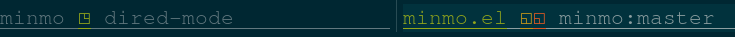

# minmo

`minmo` is a (min)imal (mo)de-line with `O(1)` git and disk status via aggressive caching and tight semantics.

This package exists because I wasn't satisfied either with emacs defaults nor any of the more elaborate alternatives.

Unfortunately the builtin `vc` package tries much too hard to be compatible with obsolete version control systems no one uses, and as a result has poor performance and more limited functionality than if it consolidated on git. `minmo` addresses these problems:

1. `auto-revert-check-vc-info` calls `git status` on *all open vc-enabled buffers*, regardless of their display status: essentially `O(N)` cost. Even on modern hardware, there's a noticeable lag above about 100 open files. `minmo` uses various hooks and the `minmo-git-cache-timer-interval` to update git status only for *visible* buffers, e.g. when calling `switch-to-buffer` or `find-file`.

2. The `vc-mode` string reports a generic status designed before the existence of git: namely it doesn't report staged status. Moreover the status strings are clunky and difficult to change.

3. There's no native mechanics for detecting orphaned files - a file-visiting buffer without a corresponding file in the filesystem. `minmo` does this with another cache and timer interval, `minmo-disk-cache-timer-interval`.

Both timers can be disabled by setting those intervals to nil, if you want even better performance: I do this my 14 year-old laptop for battery life. Even without the timers disabled, the minmo `mode-line-format` only evaluates cached variables: there's no hidden filesystem reads. All I/O happens via hooks and timers.

## install

```elisp
(use-package minmo
  :vc (:url "https://github.com/brtholomy/minmo" :rev :newest))
```

## symbol semantics

`minmo` uses a unified symbol set for git and disk status on tty and pts:

```
status             u : a : git     : disk
--------------------------------------------
unmodified       : ◻ : . : nil     : nil
modified         : ◱ : * : warning : error
ignored/readonly : ◳ : _ : success : success
staged/orphan    : ◰ : + : link    : warning
untracked/buffer : ◲ : ! : error   : link

quadrant semantics:

left              ◱◰ : modified/staged    : indexed
right             ◳◲ : ignored/untracked  : unindexed
top               ◰◳ : staged/ignored     : ready
bottom            ◱◲ : modified/untracked : unready
```

After a while, you may find them intuitive. But all of this can be changed easily by redefining `minmo-status-alist`. Just copy the default and change strings and faces as you like.

## screenshots

In my own theme, `modus-vivendi`, and `solaris-dark`:




## mode-line-format

`minmo` sets `mode-line-format` to provide:

* buffer-name
* git and disk status
* project-name
* git branch
* major-mode
* minor-mode selectively
* narrow indicator
* line:col
* total lines

But `mode-line-format` can easily be set as you wish, using the default as a starting point. The primary value here are the caching routines for getting git and disk status with good performance.

If you wanted an even more minimal mode-line, eval something like this:

```elisp
(setq-default
 mode-line-format
 (list
  '(:eval (minmo-buffer-name))
  '(:eval (minmo-git-status))
  '(:eval (minmo-disk-status))
  ))
```

## auto-revert-mode

`global-auto-revert-mode` can still be enabled, but I recommend the following when using `minmo` to avoid unnecesary polling:

```elisp
(setopt auto-revert-check-vc-info nil
        auto-revert-use-notify t
        auto-revert-avoid-polling t)
```

# caveats

* The goal here is maximum efficiency while preserving useful git and disk status across emulated and real terminals. I imagine anyone wanting this would also want to customize their mode-line, so this is less about a complete solution than a useful piece of it.

* Nongoals include icons and other eyecandy. If you want more features pick something like [doom-modeline](https://github.com/seagle0128/doom-modeline).

* Font: I've chosen some fairly esoteric unicode points so if they look wrong on your system it's probably your font. Pick a string that looks good on your machine.
